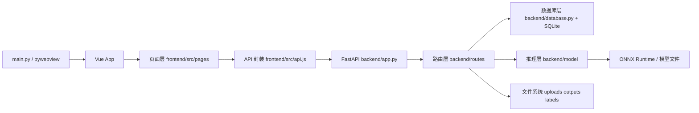
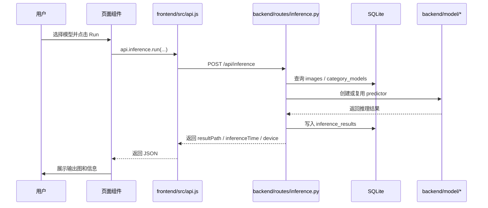
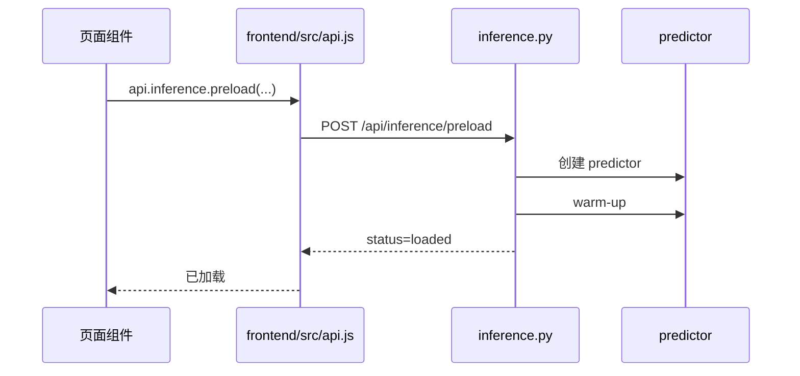
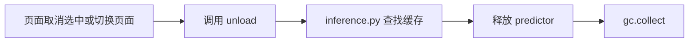

# Software Architecture（软件架构）

> Updated: 2026-04-13（更新日期）

## 项目架构总览

更新时间：2026-04-12  
适用读者：新接手开发者、项目维护者、需要快速理解系统结构的人

---

## 1. 项目定位

该项目是一个本地运行的 AI 视觉推理工作台，支持：

- 模型管理
- 图片上传
- 单图推理
- 批量推理
- 视频推理
- 推理结果展示
- 多任务页面切换

从形态上看，它不是单纯的 Web 应用，而是：

`桌面壳 + Vue 前端 + FastAPI 后端 + SQLite 元数据 + ONNX Runtime 推理层`

的组合系统。

---

## 2. 全局架构图



这张图的重点是：

- `main.py` 只是宿主，不是业务核心
- 真正的业务主线是：页面 -> API -> 路由 -> 数据/推理
- 数据库存的是元数据，文件系统存的是实体资源，推理层执行真实模型

---

## 3. 顶层目录结构

```text
demo040501/
├─ main.py
├─ frontend/
├─ backend/
├─ labels/
├─ models/
├─ outputs/
└─ backend/model/
```

### 重点目录说明

#### `frontend/`

前端目录。包含源码、静态资源、Vite 配置、npm 依赖声明和构建产物。

#### `frontend/src/`

前端源码目录。负责界面、交互、状态和 API 调用。

#### `backend/`

后端服务目录。负责数据库、上传、推理、结果输出。

#### `backend/model/`

后端推理模块目录。负责预处理、ONNX Session 执行、后处理和可视化绘制。

#### `backend/uploads/`

上传文件目录。图片和视频先上传到这里，再以 `imageId/videoId` 形式参与推理。

#### `backend/outputs/`

推理结果输出目录。结果图和结果视频由后端生成，前端直接通过静态路径访问。

#### `labels/`

标签输出目录，用于保存检测/分割等结构化结果。

---

## 4. 分层结构说明

项目可以分成五层：

1. 桌面宿主层
2. 前端展示与交互层
3. 前端 API 适配层
4. 后端路由与业务编排层
5. 数据与推理执行层

---

## 5. 桌面宿主层

核心文件：

- `main.py`

### 作用

- 检查前端构建产物是否存在
- 如果存在，加载 `frontend/dist/index.html`
- 如果不存在，回退到开发模式地址
- 使用 `pywebview` 创建桌面窗口

### 为什么这一层重要

它决定了产品最终是“桌面软件”而不是“浏览器页面”，但它不参与推理、模型管理和数据库逻辑。

### 这一层的设计重点

- 低耦合
- 尽量不侵入业务逻辑
- 只做应用宿主和窗口承载

换句话说：

> `main.py` 是外壳，不是核心。

---

## 6. 前端展示与交互层

前端采用：

- Vue 3
- Vue Router
- Vite

核心入口：

- `src/main.js`
- `src/App.vue`

### 6.1 根应用结构

`App.vue` 的整体布局是：

- 左侧 `Sidebar`
- 中间主内容区
- 内容区内部按路由切换页面
- 底部 `Footer`

这是一种典型的：

`全局壳层 + 页面内容区`

架构。

### 6.2 路由层

核心文件：

- `src/router/index.js`

当前主要页面路由：

- Home
- Segmentation
- Detection
- Classification
- Restoration
- Pose
- OBB
- Settings
- About

### 路由层的重点

- 路由只负责页面映射
- 不承载业务逻辑
- 页面逻辑主要放在各自 `.vue` 文件中

---

## 7. 前端重点模块

### 7.1 页面层 `frontend/src/pages`

这是前端最重要的一层。每个页面本质上都是一个任务控制器。

核心页面：

- `src/pages/DetectionPage.vue`
- `src/pages/SegmentationPage.vue`
- `src/pages/ClassificationPage.vue`
- `src/pages/PoseEstimationPage.vue`
- `src/pages/OBBDetectionPage.vue`
- `src/pages/RestorationPage.vue`
- `src/pages/SettingsPage.vue`

### 页面层负责什么

通常一个任务页会负责：

- 加载当前任务的模型列表
- 展示 `Available Models`
- 管理模型选择和取消选择
- 触发预加载与卸载
- 上传图片或视频
- 设置推理参数
- 发起推理请求
- 渲染结果图、耗时、设备信息

### 页面层的设计特点

- 业务逻辑集中
- 状态基本就地维护
- 开发效率高

### 页面层的代价

- 页面文件较长
- 公共逻辑重复较多

这也是当前项目后续最值得继续抽象的地方。

---

### 7.2 通用组件层 `frontend/src/components`

重要组件：

- [src/components/Sidebar.vue](./frontend/src/components/Sidebar.vue)
- `Footer.vue`

### `Sidebar.vue`

职责：

- 根据导航常量渲染菜单
- 区分顶部、滚动区、底部导航
- 发出导航事件
- 支持紧凑/展开两种模式

重点：

- 它只做导航展示
- 不直接处理推理、模型、数据库

这是一个标准的“无业务组件”。

---

### 7.3 设置状态层 `frontend/src/composables/useSettings.js`

核心文件：

- [src/composables/useSettings.js](./frontend/src/composables/useSettings.js)

### 作用

- 提供全局设置状态
- 从 `localStorage` 读取设置
- 自动保存设置
- 应用主题

### 当前设置项

- `theme`
- `sidebarCompact`
- `animations`
- `defaultDevice`
- `autoDownload`
- `precision`
- `batchSize`
- `workerThreads`
- `apiBase`

### 模块重点

这不是完整状态管理框架，而是一个轻量级全局配置中心。

它解决的是：

- 全局设置共享
- 持久化
- 主题应用

而不是复杂业务状态同步。

---

### 7.4 API 适配层 `frontend/src/api.js`

核心文件：

- [src/api.js](./frontend/src/api.js)

### 作用

- 统一封装 `fetch`
- 动态读取 `settings.apiBase`
- 按领域组织 API 方法

主要 API 分组：

- `algorithms`
- `allModels`
- `newModels`
- `categoryModels`
- `images`
- `inference`
- `exports`

### 模块重点

它是前端和后端之间的边界层。

好处：

- 页面组件不用关心具体 URL 拼接
- 后端 API 调整时只需集中修改

---

## 8. 后端架构

后端采用 FastAPI。

核心入口：

- [backend/app.py](./backend/app.py)

### 后端主要职责

- 提供 REST API
- 管理模型元数据
- 接收上传图片和视频
- 调度推理
- 输出结果文件
- 提供导出接口

---

## 9. 后端重点模块

### 9.1 应用入口 `backend/app.py`

职责：

- 创建 FastAPI 实例
- 配置 CORS
- 初始化数据库
- 注册路由
- 挂载静态目录

挂载静态目录：

- `/uploads`
- `/outputs`
- `/labels`

### 为什么重要

它把“API 服务”和“结果资源访问”放进了同一个服务里，前端因此可以直接显示输出图片和结果视频。

---

### 9.2 路由聚合层 `backend/routes/__init__.py`

职责：

- 集中导出路由
- 由 `app.py` 统一注册

当前路由模块：

- [backend/routes/algorithms.py](./backend/routes/algorithms.py)
- [backend/routes/models.py](./backend/routes/models.py)
- [backend/routes/images.py](./backend/routes/images.py)
- [backend/routes/inference.py](./backend/routes/inference.py)
- [backend/routes/exports.py](./backend/routes/exports.py)

这是典型的“按业务领域拆分路由”设计。

---

### 9.3 算法管理模块 `algorithms.py`

职责：

- 维护任务分类
- 提供算法列表给前端

它管理的是：

- detection
- segmentation
- classification
- restoration

重点：

这层提供的是“任务分类元数据”，不是推理逻辑。

---

### 9.4 模型管理模块 `models.py`

职责：

- 维护全量模型目录
- 维护新模型目录
- 维护按任务分类的模型元数据

最关键的数据表是：

- `category_models`

### 为什么 `category_models` 是核心

前端页面展示的 `Available Models`，以及后端推理时读取的：

- 模型名称
- 模型路径
- 输入尺寸
- 类别数
- 性能指标

基本都来自这张表。

这意味着：

> 当前项目不是“自动扫描模型目录”型系统，而是“数据库驱动的模型配置系统”。

---

### 9.5 上传模块 `images.py`

职责：

- 接收上传文件
- 生成唯一文件名
- 写入 `uploads`
- 记录到数据库

### 重点

项目采用两阶段推理模式：

1. 先上传文件
2. 再根据 `imageId/videoId` 发起推理

这种方式比“推理接口里直接传原文件”更适合：

- 页面回显
- 批处理
- 结果追踪

---

### 9.6 推理编排模块 `inference.py`

这是后端最核心的模块。

职责：

- 接收推理请求
- 查询图片记录
- 查询模型元数据
- 根据任务创建或复用预测器
- 进行预加载、预热、推理、卸载
- 记录结果

### 当前承担的关键能力

- 设备标准化
- 模型缓存
- 预热 warm-up
- 任务分流
- 单图推理
- 视频推理
- 卸载释放

### 为什么它是系统核心

因为它连接了三端：

- 前端请求
- 数据库元数据
- 模型执行层

如果把项目比作生产线，`inference.py` 就是调度中心。

---

### 9.7 导出模块 `exports.py`

职责：

- 根据结果 ID 返回导出信息

当前状态：

- 更接近占位接口
- 已有结构，但不是项目复杂核心

---

## 10. 数据层

核心文件：

- [backend/database.py](./backend/database.py)

### 10.1 作用

- 提供 SQLite 连接
- 初始化数据库表
- 写入种子数据

### 10.2 为什么选 SQLite

对于本地桌面型工具，SQLite 的优点很明确：

- 部署简单
- 无需额外数据库服务
- 适合中小规模元数据管理

### 10.3 核心数据表

#### `algorithms`

- 保存任务分类

#### `all_models`

- 保存所有模型的总目录信息

#### `new_models`

- 保存首页或推荐区模型

#### `category_models`

- 保存任务页面真实使用的模型元数据

#### `images`

- 保存上传文件记录

#### `inference_results`

- 保存推理输出结果记录

### 数据层重点

数据库存的是：

- 元数据
- 路径
- 状态

真正的二进制文件在文件系统中：

- 上传文件在 `uploads`
- 输出文件在 `outputs`
- 标签文件在 `labels`

---

## 11. 推理执行层 `backend/model`

这是“真正跑模型”的地方。

重要模块：

- [backend/model/yolo_detection.py](./backend/model/yolo_detection.py)
- [backend/model/yolo_classification.py](./backend/model/yolo_classification.py)
- [backend/model/yolo_seg.py](./backend/model/yolo_seg.py)
- [backend/model/yolo_pose.py](./backend/model/yolo_pose.py)
- [backend/model/yolo_obb.py](./backend/model/yolo_obb.py)
- [backend/model/video_detection.py](./backend/model/video_detection.py)
- [backend/model/xxxx_seg.py](./backend/model/xxxx_seg.py)

---

### 11.1 推理器的通用结构

这些推理器普遍遵循同一套路：

1. 读取 ONNX 模型
2. 根据设备创建 Session
3. 解析输入尺寸
4. 预处理输入图像
5. 执行 ONNX 推理
6. 后处理输出
7. 绘制结果
8. 返回结果和耗时

### 这一层的重点

- 它不关心页面
- 不关心数据库
- 只关心“如何把输入变成结果”

这是一层纯执行逻辑。

---

### 11.2 各推理模块的重点

#### `yolo_detection.py`

负责：

- 普通目标检测
- 兼容 `yolo11` 和 `yolo26`
- 解析框、得分、类别

重点：

- 已支持 raw-head 与 end-to-end 两种输出格式

#### `yolo_seg.py`

负责：

- 实例分割
- mask 解码
- 掩码绘制

重点：

- 后处理复杂度高于普通检测

#### `yolo_classification.py`

负责：

- 分类推理
- top-k 结果计算

重点：

- 结构相对最简单

#### `yolo_pose.py`

负责：

- 姿态框和关键点解析
- 骨架绘制

重点：

- 依赖 `num_joints`

#### `yolo_obb.py`

负责：

- 旋转框解析
- `xywhr` 转 polygon

重点：

- 比普通检测多一个角度维度

#### `video_detection.py`

负责：

- 逐帧读取视频
- 调用图像预测器
- 重编码输出视频

重点：

- 视频推理本质上是对图像推理器的逐帧复用

#### `xxxx_seg.py`

负责：

- 提供 `xxxx` 分割推理示例
- 作为后续接入非 YOLO 分割模型的参考实现

重点：

- 当前还是独立示例脚本
- 还没有接入 `backend/routes/inference.py` 的统一分流

---

## 12. 关键调用链

### 12.1 单图推理链路



### 12.2 模型预加载链路



### 12.3 页面离开或取消选中



---

## 13. 当前架构的优点

1. 前后端职责清楚
2. 元数据和推理执行分离
3. 本地部署简单
4. 适合持续增加新任务页和新模型
5. 预加载与缓存机制已经具备实用价值

---

## 14. 当前架构的主要限制

1. 页面组件过重，很多页面同时承担 UI、状态、API 编排职责
2. `inference.py` 过于核心，已开始承担较多服务层职责
3. 数据模型仍存在兼容性存储，例如 `Pose` 的关节数
4. 某些设置项仍未彻底和真实执行逻辑对齐

---

> 这是一个以 Vue 页面组织任务、以 FastAPI 编排推理、以 SQLite 保存元数据、以 ONNX Runtime 执行模型的本地桌面化 AI 推理平台。
