# Feature Overview（功能介绍）

> Updated: 2026-04-13（更新日期）

## AI Studio

- 闲暇之余，写了一个算法测试工具，也当作自己的项目集用，在此记录下，主要使用 `pywebview`、`Vue 3`、`FastAPI`、`ONNX` 构建，后续有空会继续加入 `NCNN` 等推理框架。

---

## 页面总览

| 页面 | 路由 | 主要用途 |
| --- | --- | --- |
| 首页 | `/` | 展示算法入口与模型总览 |
| 检测页 | `/detection` | 目标检测、批量检测、视频检测 |
| 分割页 | `/segmentation` | 图像分割、批量分割、模型预加载 |
| 分类页 | `/classification` | 图像分类、批量分类 |
| 图像修复页 | `/restoration` | 单图修复、批量修复、修复模型配置 |
| 姿态估计页 | `/pose` | 人体或目标关键点姿态估计 |
| OBB 页 | `/obb` | 旋转框目标检测 |
| 设置页 | `/settings` | 外观、默认设备、API 地址等全局配置 |
| 关于页 | `/about` | 项目简介、功能特性、技术栈和系统信息 |

---

## 1. 首页

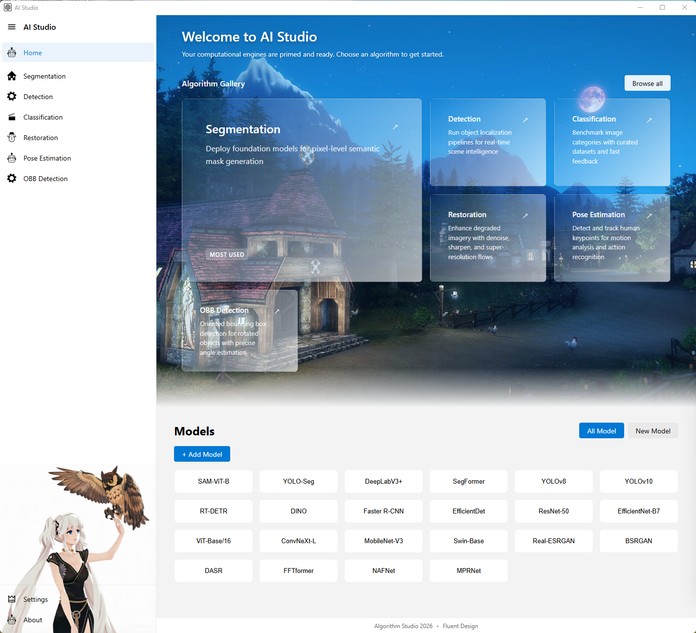

图注：首页展示算法入口、模型总览和最近模型记录，是系统的总导航页。

### 页面定位

首页是整个系统的总入口，用于帮助用户快速进入不同算法页面，并查看当前系统中已经维护的模型信息。

### 主要功能

- 展示 `Algorithm Gallery`，以卡片形式展示各算法方向
- 提供高亮的主推算法入口
- 展示模型总表和新模型列表
- 支持新增和删除首页展示的模型记录
- 支持从模型列表直接跳转到对应算法页面

### 阅读重点

- 适合在文档开头作为项目总览页展示
- 既能体现产品支持的算法范围，也能体现模型管理能力

---

## 2. 检测页

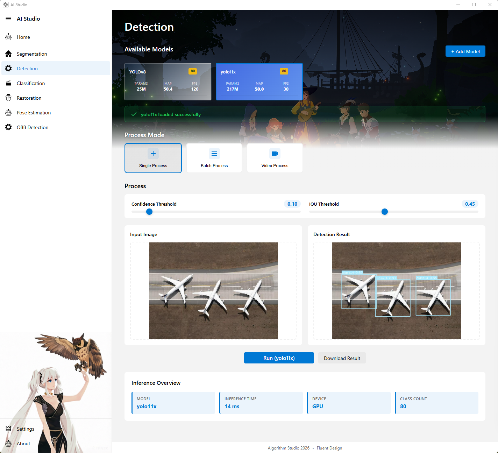

图注：检测页亮色主题，展示模型选择、单图检测、批量检测和推理结果区域。

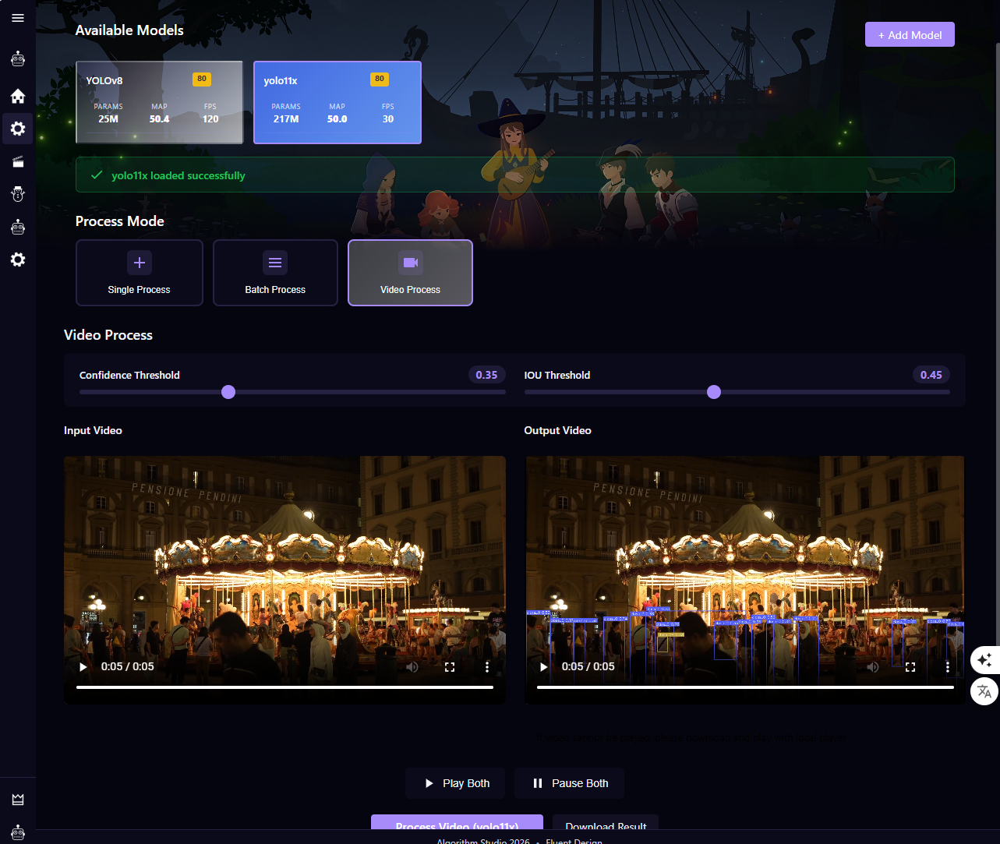

图注：检测页暗色主题，便于展示系统在不同主题下的界面一致性。

### 页面定位

检测页用于执行目标检测任务，是当前功能最完整的页面之一。

### 主要功能

- 展示可用检测模型
- 点击模型卡片后预加载模型权重
- 支持单图检测
- 支持批量图像检测
- 支持视频检测
- 支持新增自定义检测模型
- 支持调整检测参数，例如置信度阈值和 IOU 阈值
- 展示推理结果图、推理时间、设备信息等推理摘要

---

## 3. 分割页

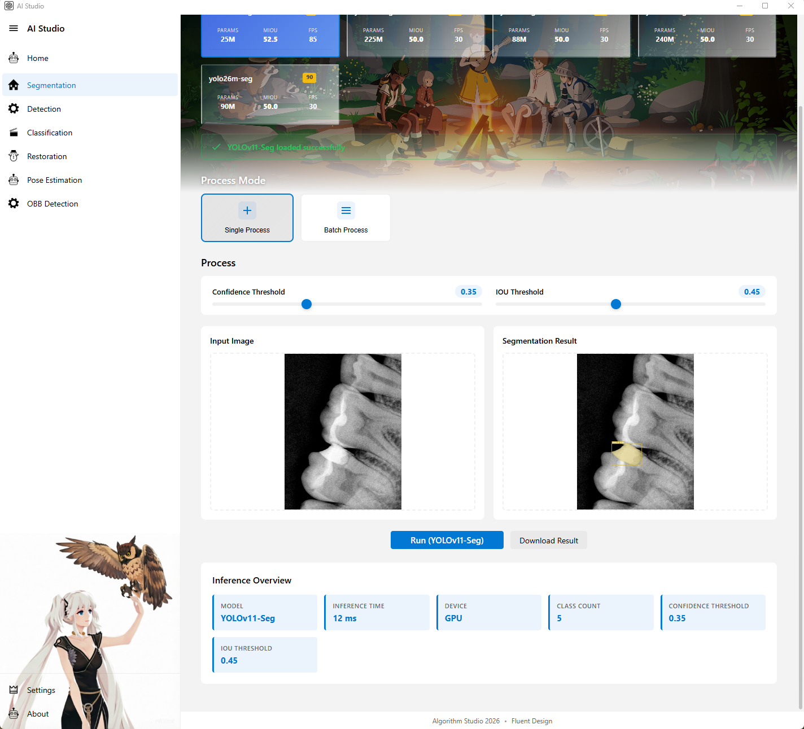

图注：分割页主界面，展示模型选择、分割参数、输入输出和推理信息。

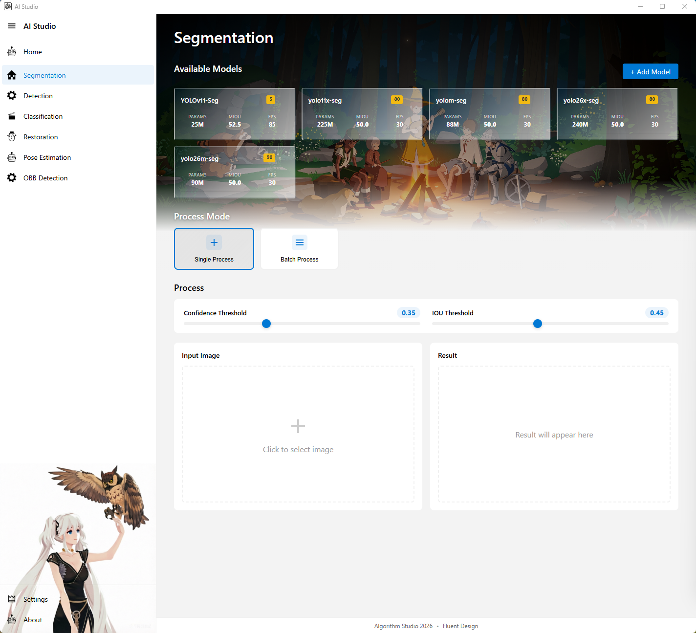

图注：分割页补充截图，可用于展示模型状态提示或结果展示细节。

### 页面定位

分割页用于执行实例分割或语义分割任务，目前支持 `YOLO Seg` 和 `Mask2Former` 等分割模型链路。

### 主要功能

- 展示可用分割模型
- 点击模型卡片时预加载模型
- 支持单图分割
- 支持批量分割
- 支持新增和维护分割模型
- 支持按模型架构区分推理路径
- 展示模型加载状态、推理结果和推理信息

---

## 4. 分类页

### 页面定位

分类页用于执行图像分类任务，适合展示单标签或多类别概率输出。

### 主要功能

- 展示可用分类模型
- 点击模型卡片时预加载模型
- 支持单图分类
- 支持批量分类
- 支持新增分类模型
- 展示分类结果与概率信息
- 展示推理时间和运行设备

---

## 5. 图像修复页

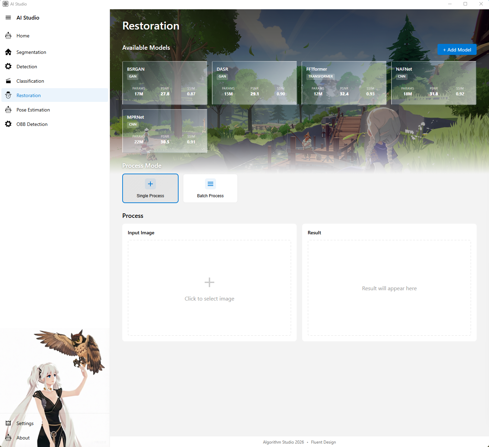

图注：图像修复页展示模型选择、修复前后结果对比，以及修复模型配置入口。

### 页面定位

图像修复页用于执行图像增强、去噪、去模糊、超分辨率等图像到图像任务。

### 主要功能

- 展示可用修复模型
- 点击模型卡片后预加载修复模型
- 支持单图修复
- 支持批量修复
- 支持新增修复模型
- 新增模型时支持配置：
  - `Model Path`
  - `Input Size`
  - `Padding Size`
- 展示修复前后图像对比和推理信息
- 当前修复链路支持在推理前按配置做 padding，推理后裁切，并恢复到原图尺寸

---

## 6. 姿态估计页

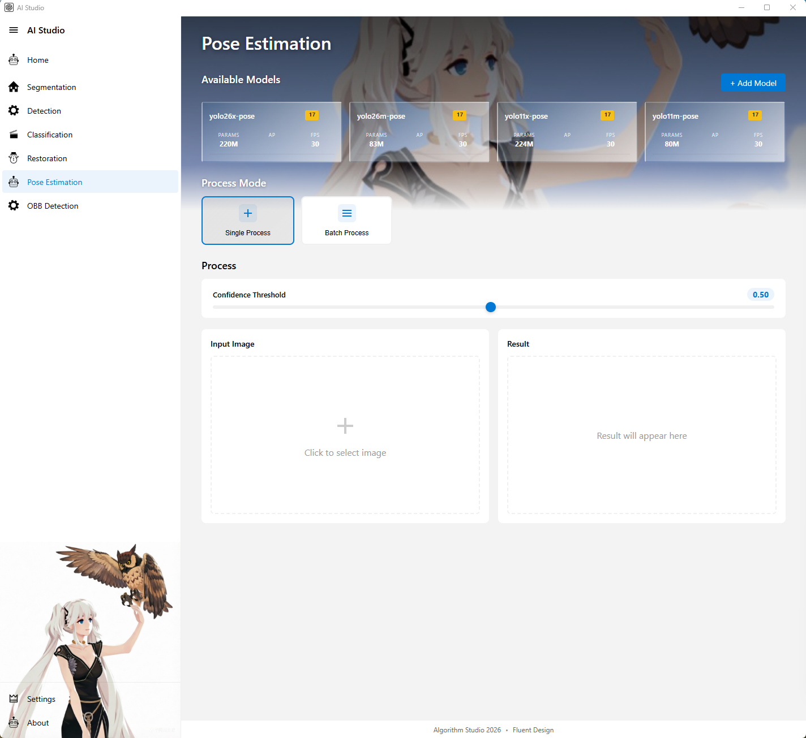

图注：姿态估计页展示关键点模型选择、输入输出区域和推理结果摘要。

### 页面定位

姿态估计页用于关键点检测和姿态可视化任务。

### 主要功能

- 展示可用姿态估计模型
- 点击模型卡片后预加载模型
- 支持单图姿态估计
- 支持批量姿态估计
- 支持新增和编辑模型
- 展示推理时间、设备、关节点数量等信息
- 展示模型加载状态提示

---

## 7. OBB 页面

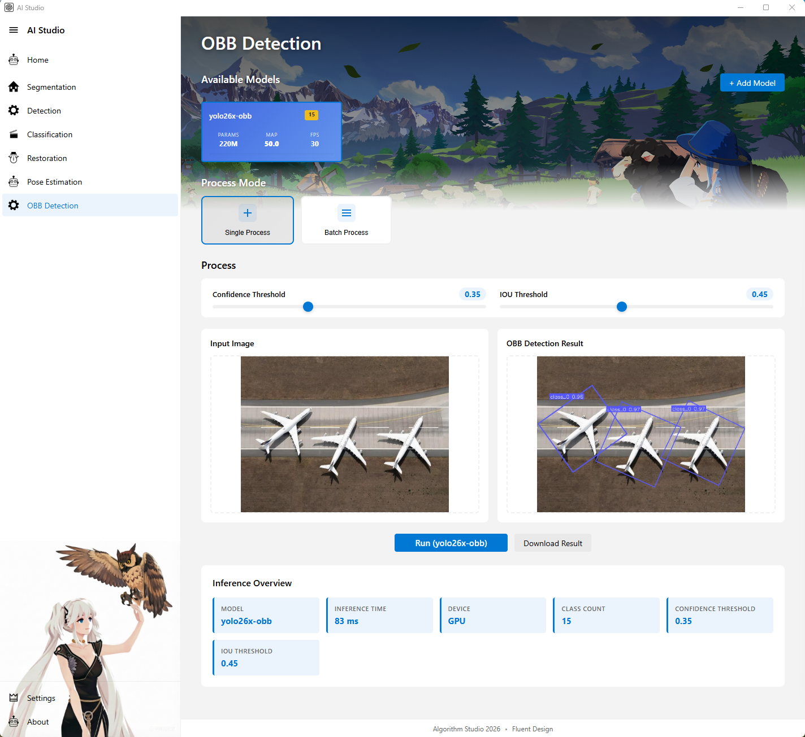

图注：OBB 页面展示旋转框检测结果，适合工业检测和方向敏感场景。

### 页面定位

OBB 页面用于旋转框目标检测，适合工业检测、遥感检测等需要角度信息的场景。

### 主要功能

- 展示可用 OBB 模型
- 点击模型卡片后预加载模型
- 支持单图 OBB 检测
- 支持批量 OBB 检测
- 支持新增 OBB 模型
- 支持调整置信度和 IOU 阈值
- 展示推理结果、类别数量、设备和推理时间
- 展示模型加载状态提示

---

## 8. 设置页

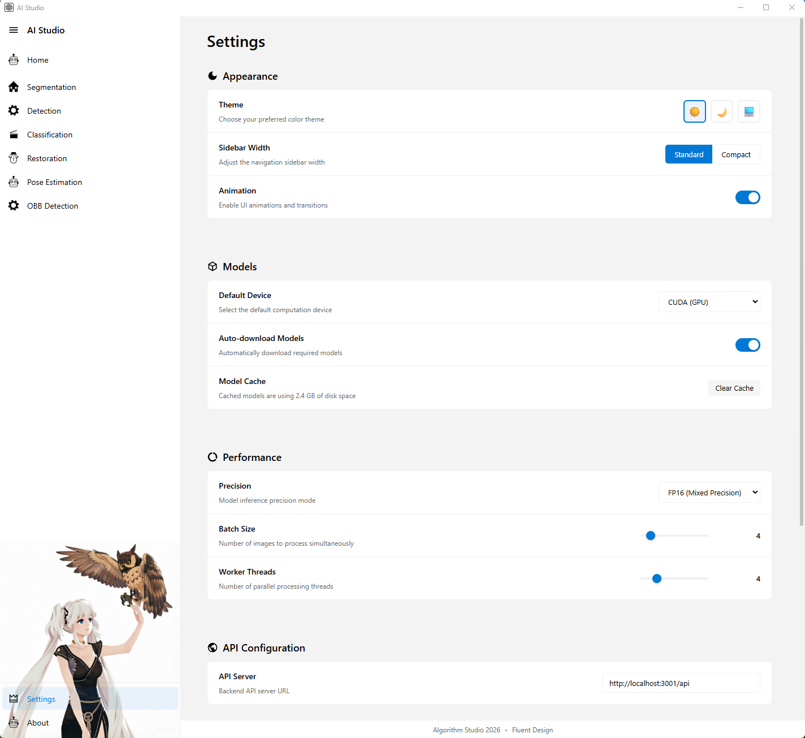

图注：设置页亮色主题，展示外观、模型、性能和 API 配置。

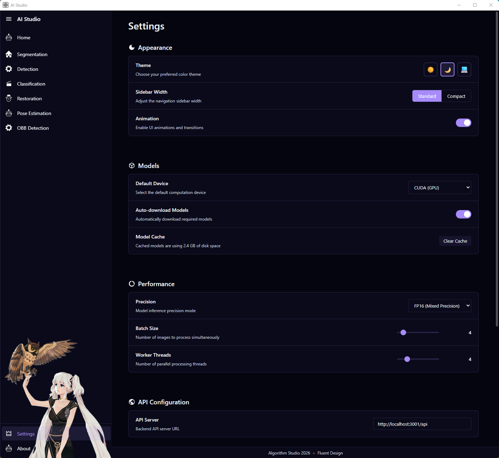

图注：设置页夜间主题，用于展示系统在不同主题下的设置界面效果。

### 页面定位

设置页用于管理系统级配置，是前端和推理默认行为的集中配置入口。

### 主要功能

- 管理外观设置
  - 主题
  - 侧边栏宽度
  - 动画开关
- 管理模型相关设置
  - 默认设备
  - 自动下载模型
  - 模型缓存显示
- 管理性能设置
  - 精度
  - 批大小
  - 工作线程
- 管理 API 地址
- 支持一键重置全部设置

---

## 9. 关于页

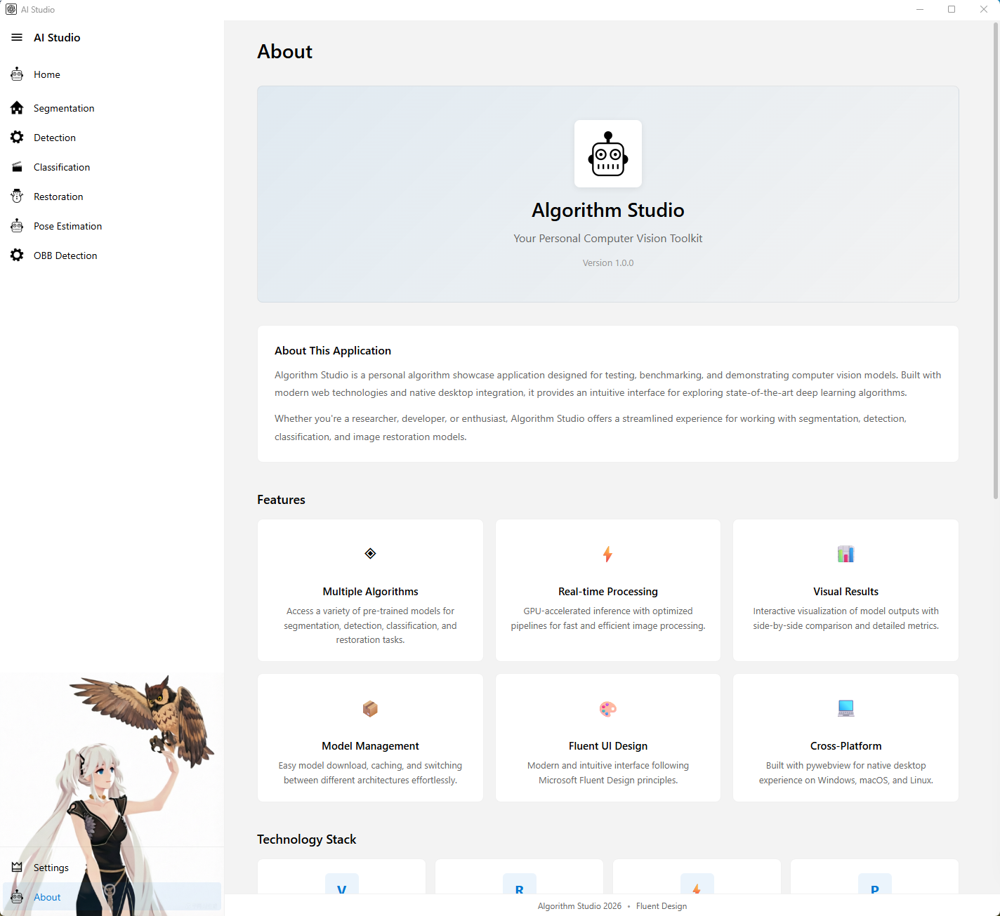

图注：关于页展示项目简介、核心特性、技术栈和系统信息。

### 页面定位

关于页用于介绍项目背景、功能范围和技术实现，是文档性最强的一个页面。

### 主要功能

- 展示应用名称、版本和简介
- 展示系统支持的主要功能
- 展示技术栈
- 展示开源项目致谢
- 展示系统信息
- 提供检查更新、文档和问题反馈入口
